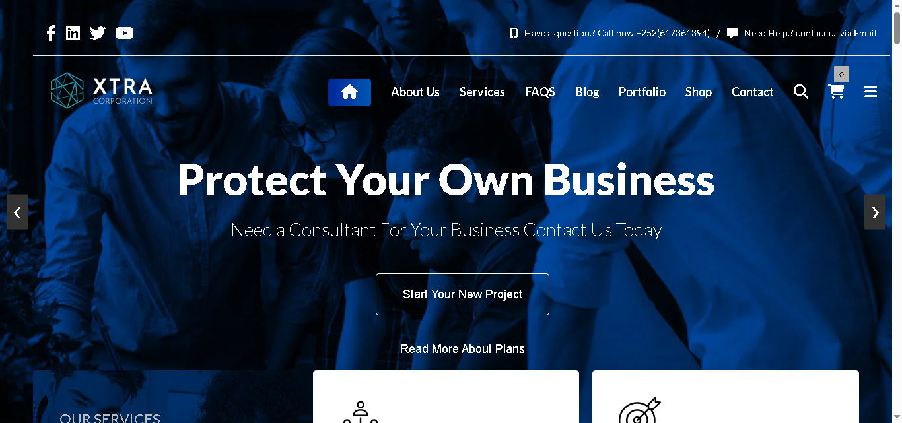

# 💼 Business Agency Website

[](https://business-agency-website-theta.vercel.app/HTML/index.html)  
[](https://github.com/Abdiladiif-Abdisamed/Business-Agency-Website.git)  
[](https://business-agency-website-theta.vercel.app/HTML/index.html)  
[](#-license)

---

## 📌 Project Description

A modern and responsive **Business Agency Website** built using HTML, CSS, JavaScript, and Font Awesome.  
It provides a professional platform for businesses to showcase their services, interact with clients, and boost online credibility.

---

## 🎯 Purpose

- Professionally display company services  
- Build trust and attract new clients  
- Visually represent the brand identity  
- Offer full responsiveness across devices

---

## 🚀 Key Features

- ✅ Fully Responsive Design – works on mobile, tablet, and desktop  
- ✅ Hero Section with Background Video  
- ✅ Animated Business Counters  
- ✅ Services Section with Font Awesome Icons  
- ✅ Add to Cart functionality for product-based features  
- ✅ Cart Data stored with **Cookies** and **`localStorage`**  
- ✅ External API Integration (e.g., product listings or testimonials)  
- ✅ Smooth and intuitive UI/UX  
- ✅ Font Awesome 6.6.0 Integration

---

## 🧰 Tech Stack

- **HTML5**  
- **CSS3**  
- **Vanilla JavaScript**  
- **Font Awesome 6.6.0**  
- **Cookies** – for user-side data storage  
- **`localStorage`** – for persisting cart/API data  
- **External APIs** – for dynamic content integration
- **Vercal** Deployment

---

## 📸 Screenshots

### 🏠 Home Page  



---

## 🔧 Installation & Usage

1. **Clone the repository**
   ```bash
   git clone https://github.com/dugsiiyeinc/Business-Agency-website.git


2. *Navigate to the folder*
   bash
   cd Business-Agency-website
   

3. *Open HTML/index.html in your browser*

---

## 🌐 Live Website

Visit the live demo here:  
🔗 [https://business-agency-website-theta.vercel.app/HTML/index.html](https://business-agency-website-theta.vercel.app/HTML/index.html)

---

## 👥 Contributors

- 👤 *Abdiladiif Abdisamed Ali*  
  📧 cabdiladiifcabdisamed@gmail.com  


---

## 📎 Repository

GitHub: [Business Agency Website](https://github.com/Abdiladiif-Abdisamed/Business-Agency-Website.git)

---

## 📝 License

This project is licensed under the *MIT License*.  
Feel free to use, modify, and distribute with proper attribution.

---

> 💡 *Designed and Developed by Abdiladiif Abdisamed for Business Purposes*  
> If you like this project, feel free to ⭐ the repo and share with others!


